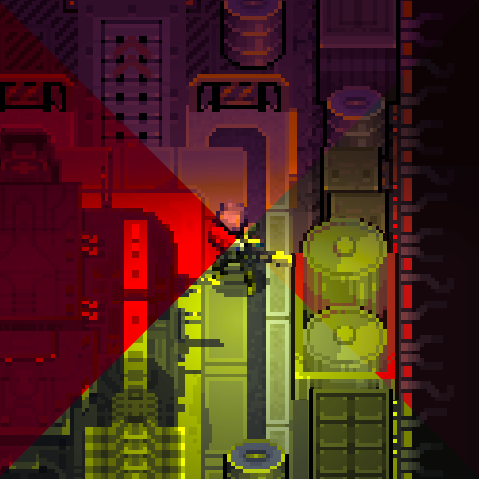

# QM_ColorTuner

A simple color tuner that can help colorblind people to see colors more clearly.
Also just a fun mod if you want to play around with colors.

## Features

* Contrast
* Saturation
* HueShift
* Exposure

### Colorblind types supported:

|Index|Type|Description|
|--|--|--|
|0|Normal|Normal Vision|
|1|Protanopia|Red-blind (missing L-cones)|
|2|Deuteranopia|Green-blind (missing M-cones)|
|3|Tritanopia|Blue-blind (missing S-cones)|
|4|Protanomaly|Red-weak (anomalous L-cones)|
|5|Deuteranomaly|Green-weak (anomalous M-cones)|
|6|Tritanomaly|Blue-weak (anomalous S-cones)|
|7|Monochromacy|Complete color blindness|
|8|Custom Matrix|User-defined color transformation|

Also you can enable custom matrix to play with 3x3 Color Transformation Matrix.

- **Customizable Configuration**: Allows users to adjust settings through a [Mod Configuration Menu (MCM).](https://steamcommunity.com/sharedfiles/filedetails/?id=3469678797)

## Requirements (Optional)

- **MCM (Mod Configuration Menu)**: A configuration menu framework to manage settings via an in-game interface.

As alternative you can find config files in:
- `%AppData%\..\LocalLow\Magnum Scriptum Ltd\Quasimorph_ModConfigs\QM_ColorTuner\config_mcm.ini`

# Configuration
|Name|Default|Description|
|--|--|--|
|EnableColorTuner|true|Enable color tuner|
|UpdateRate|60|Updates per second. Range is 60 to 240.|
|Contrast|0|Contrast adjustment. Range is -100 to 100.|
|Saturation|0|Saturation adjustment. Range is -100 to 100.|
|HueShift|0|Hue Shift adjustment. Range is -180 to 180.|
|Exposure|0|Exposure adjustment. Range is -5 to 5.|
|ColorBlindIndex|1|Color blind type. See numbers . Range is 0 to 8.|

# Source Code
Source code is available on [GitHub](https://github.com/ARZUMATA/QM-ARZUMATA-ColorTuner)

Thanks to NBK_RedSpy, Crynano and all the people who make their code open source.

# Change Log
## 1.0 (be5287f)
* Initial release

